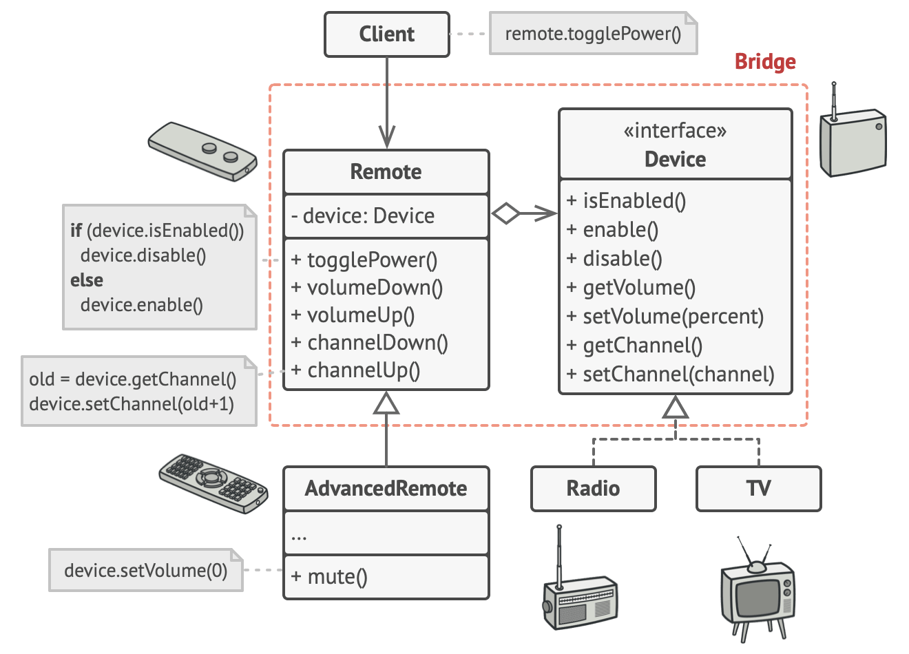

# Bridge pattern
Bridge is a structural design pattern that lets you split a large class or a set of closely related classes into two separate hierarchies—abstraction and implementation—which can be developed independently of each other.
## Problem
Design an app that manages devices and their remote controls. 
## Solution

