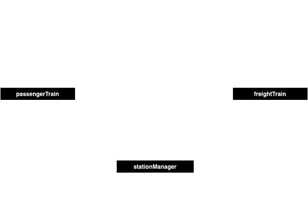

# Mediator pattern
    Mediator is a behavioral design pattern that lets you reduce chaotic dependencies between objects. The pattern restricts direct communications between the objects and forces them to collaborate only via a mediator object.
## Problem
    Design a railway station traffic system. The station makes the platform available to only one of the arriving trains while keeping the rest in a queue. A departing train notifies the stations, which lets the next train in the queue to arrive.
## Solution

